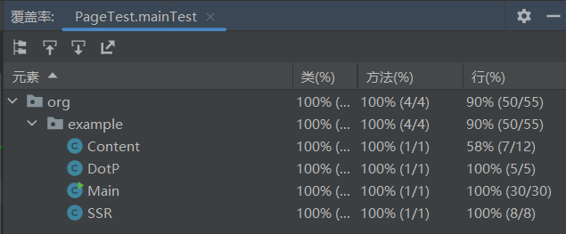

# 工程概论作业二——个人项目

本次项目的Github链接：https://github.com/ZhaoXiongNi/ZhaoXiongNi/tree/main/202121331017

(此链接已经进入要求的仓库文件夹中，总仓库地址：https://github.com/ZhaoXiongNi/ZhaoXiongNi)

## 基本信息

| 这个作业属于哪个课程 | [工程概论](https://edu.cnblogs.com/campus/jmu/ComputerScience21) |
| :------------------- | :----------------------------------------------------------: |
| 这个作业要求在哪里   | [个人项目](https://edu.cnblogs.com/campus/jmu/ComputerScience21/homework/13034) |
| 这个作业的目标       | 进一步熟悉Github得使用，完成查重算法的设计与测试，学习搭建项目的流程 |

## 需求

题目：论文查重

描述如下：

设计一个论文查重算法，给出一个原文文件和一个在这份原文上经过了增删改的抄袭版论文的文件，在答案文件中输出其重复率。

- 原文示例：今天是星期天，天气晴，今天晚上我要去看电影。
- 抄袭版示例：今天是周天，天气晴朗，我晚上要去看电影。

要求输入输出采用文件输入输出，规范如下：

- 从**命令行参数**给出：论文原文的文件的**绝对路径**。
- 从**命令行参数**给出：抄袭版论文的文件的**绝对路径**。
- 从**命令行参数**给出：输出的答案文件的**绝对路径**。

我们提供一份样例，课堂上下发，上传到班级群，使用方法是：orig.txt是原文，其他orig_add.txt等均为抄袭版论文。

注意：答案文件中输出的答案为浮点型，精确到小数点后两位

## 开发环境

语言选择：Java 17

使用工具：IDEA 2022.2.2

测试环境：Windows11 22H2


## PSP表格

| PSP2.1                                  | Personal Software Process Stages        | 预估耗时（分钟） | 实际耗时（分钟） |
| --------------------------------------- | --------------------------------------- | ---------------- | ---------------- |
| Planning                                | 计划                                    | 20               | 35               |
| · Estimate                              | · 估计这个任务需要多少时间              | 258              | 284              |
| Development                             | 开发                                    | 158              | 174              |
| · Analysis                              | · 需求分析 (包括学习新技术)             | 20               | 20               |
| · Design Spec                           | · 生成设计文档                          | 10               | 15               |
| · Design Review                         | · 设计复审                              | 5                | 1                |
| · Coding Standard                       | · 代码规范 (为目前的开发制定合适的规范) | 3                | 3                |
| · Design                                | · 具体设计                              | 30               | 20               |
| · Coding                                | · 具体编码                              | 50               | 45               |
| · Code Review                           | · 代码复审                              | 20               | 30               |
| · Test                                  | · 测试（自我测试，修改代码，提交修改）  | 20               | 40               |
| Reporting                               | 报告                                    | 100              | 110              |
| · Test Repor                            | · 测试报告                              | 40               | 60               |
| · Size Measurement                      | · 计算工作量                            | 30               | 20               |
| · Postmortem & Process Improvement Plan | · 事后总结, 并提出过程改进计划          | 30               | 30               |
|                                         | · 合计                                  |                  |                  |


## 算法思路

- 首先通过FileReader类与BufferedReader类结合读取txt文档中的文件  (在后来的代码优化中被优化为BufferedReader、InputStreamReader、FileInputStream类配合使用，后详述)
- 接下来通过现有的分词库将句子拆分成短词（考虑hanlp分词器），做进一步分析
- 使用余弦相似度计算相似度
- 最后将相似度以规定格式输出到指定文件中


## 模块接口的设计与实现

### 调用jar包指令举例

``` 
java -jar main.jar D:\Table\各科文件\工程概论\ZhaoXiongNi\202121331017\testFile\org.txt D:\Table\各科文件\工程概论\ZhaoXiongNi\202121331017\testFile\org_add.txt D:\Table\各科文件\工程概论\ZhaoXiongNi\202121331017\testFile\ans.txt
```


### 部分涉及的引用类

| 类名         | 功能                                                         |
| ------------ | ------------------------------------------------------------ |
| StringBuffer | 类似String类型，但是在需要频繁改变String的内容的时候更加高效 |
| HanLP        | hanlp分词器，提取短词                                        |
| HashMap      | 通过键值对，精简代码实现，使代码更加简洁易懂，以及为代码提供更方便的匹配 |


### 自定义类和函数

| 类名                 | 功能                                           |
| -------------------- | ---------------------------------------------- |
| Main                 | 主实现函数                                     |
| Content.getContent   | 通过文件路径检索对应位置的文件，并获取其中内容 |
| DotP.dotProduct      | 计算余弦相似度中的点积                         |
| SSR.sumOfSquareRoots | 计算余弦相似度中的平方根之和                   |


### 流程图


### 算法关键

​		我采用的是余弦相似度算法计算相似度。

算法基本公式：


​		借由这个公式，可以以数学的角度反应两篇文章的相似度，计算出的值越接近1，即越相似，上限为1。通过*100即可获取到相似率(%）。这个算法能极快的反应两篇文章的相似性，高效高能，具有很好的相似反应度。


## 测试

### 部分单元测试代码

​		因为这个项目极为简单，我将代码支撑在main函数中，使用多个类函数一起支撑main函数，而非编写与测试代码中。

​		在这里我模拟命令行输入数据，将三个相关文件的路径以arg数组的格式注入main函数，在main函数中进行处理与计算。		

``` java
import org.example.Main;
import org.junit.Test;

public class PageTest {
    @Test
    public void mainTest() throws Exception{
        //主测试函数，用以完成绝大多数测试
        String[] arg = new String[3];
        arg[0] = "D:\\Table\\各科文件\\工程概论\\ZhaoXiongNi\\202121331017\\testFile\\org.txt";
        arg[1] = "D:\\Table\\各科文件\\工程概论\\ZhaoXiongNi\\202121331017\\testFile\\org_add.txt";
        arg[2] = "D:\\Table\\各科文件\\工程概论\\ZhaoXiongNi\\202121331017\\testFile\\ans.txt";

        Main.main(arg);
    }

    @Test
    public void pathErrorTest() throws Exception{
        //测试路径错误
        String[] arg = new String[3];
        arg[0] = "D:\\Table\\各科文件\\工程概论\\ZhaoXiongNi\\202121331017\\errorPath\\org.txt";
        arg[1] = "D:\\Table\\各科文件\\工程概论\\ZhaoXiongNi\\202121331017\\testFile\\org_add.txt";
        arg[2] = "D:\\Table\\各科文件\\工程概论\\ZhaoXiongNi\\202121331017\\testFile\\ans.txt";

        Main.main(arg);
    }
}

```


### 测试数据

​		测试数据还是以相似度较高的中文文本实现。所有测试样例（10个）及其对应结果见文末（附录）


​		最后将结果写入ans.txt中


### 覆盖率

#### 主单元测试：





#### 路径错误单元测试


## 异常处理

1. 文件路径不存在

   ​		场景：该种情况会发生在管理设置查重文件时，路径设置错误导致无法读取到该文件或者该文件未被下载以进行后续任务或者文件名设置错误。

   测试样例：

   ```java
   @Test
       public void pathErrorTest() throws Exception{
           String[] arg = new String[3];
           arg[0] = "D:\\Table\\各科文件\\工程概论\\ZhaoXiongNi\\202121331017\\errorPath\\org.txt";
           arg[1] = "D:\\Table\\各科文件\\工程概论\\ZhaoXiongNi\\202121331017\\testFile\\org_add.txt";
           arg[2] = "D:\\Table\\各科文件\\工程概论\\ZhaoXiongNi\\202121331017\\testFile\\ans.txt";
   
           Main.main(arg);
       }
   ```

   ​		其中org.txt文件存在错误的路径"errorPath".

   运行结果：

   ``` 
   ......
   文件路径  D:\Table\各科文件\工程概论\ZhaoXiongNi\202121331017\errorPath\org.txt  不存在
   读取失败
   相似率：NaN %, 结果成功已转存到文件中
   
   进程已结束,退出代码0
   
   ```

   ​		

2. 文件内容为空

   ​		该场景出现在错误提交了空白文章导致的查重失败。

   测试样例：

   ``` java
   @Test
       public void mainTest() throws Exception{
           String[] arg = new String[3];
           arg[0] = "D:\\Table\\各科文件\\工程概论\\ZhaoXiongNi\\202121331017\\testFile\\org.txt";
           arg[1] = "D:\\Table\\各科文件\\工程概论\\ZhaoXiongNi\\202121331017\\testFile\\org_add.txt";
           arg[2] = "D:\\Table\\各科文件\\工程概论\\ZhaoXiongNi\\202121331017\\testFile\\ans.txt";
   
           Main.main(arg);
       }
   ```

   ​		其中org.txt文件中为空

   

   运行结果：

   ``` 
   ......
   文件路径  D:\Table\各科文件\工程概论\ZhaoXiongNi\202121331017\testFile\org.txt  为空
   相似率：NaN %, 结果成功已转存到文件中
   
   进程已结束,退出代码0
   
   ```

   

## 性能分析

​		为了测试性能，我通过配置**JProfiler**进行分析测试，得到实时内存，其中消耗性能的是int数组的创建与使用，因为在余弦相似度的计算中，需要大量的int数组存储单词出现频次，而第二第三的性能瓶颈均为hanlp分词器的使用导致的，这一部分由于事先封装无法简单优化。

​		为了实现这个优化，我计划从可以下手的int[]数组下手，通过**稀疏数组**的途径进行优化，可以缩减int[]数组占用的内存量。

性能分析图：


## 遇到的问题

### 在Windows PowerShell 与IDEA运行结果不一致

​		这个问题是由于编码导致的，虽然凭直觉，文件读取只需要涉及到文件本身的编码就可以进行查重，不会背终端影响，但是会的。在

Windows PowerShell 中使用的不是UTF-8，这导致终端在转换时会先转换为规律乱码进行查重，得到查重率56%左右，而在IDEA中运行结果为86.03%的一个高查重率，显然第二个运行更加贴近。

​		为了解决这个问题，只需要在读取文件的时候设置编码格式，这就要舍弃原先思路中的通过FileReader类与BufferedReader类结合读取txt文档中的文件  而是改为BufferedReader、InputStreamReader、FileInputStream类配合使用，这样就可以设置为UTF-8，如下：

``` java
fileReader = new BufferedReader(new InputStreamReader(new FileInputStream(filePath),StandardCharsets.UTF_8)); //文件内容读取器
```

​		这样比较完美就可以解决这个问题。经测试一致。


## 代码质量分析结果

​		消除了代码中存在的所有警告（warning）和错误（error）


## 参考文献

[1] [余弦相似性 - 维基百科，自由的百科全书 (wikipedia.org)](https://zh.wikipedia.org/wiki/余弦相似性)


## 附录

### 所有测试样例及其测试结果

1. 相似

   测试数据：

   测试结果（终端）：

   测试结果（写入）：

2. 单空
   测试数据：

   测试结果（终端）：

   测试结果（写入）：

   

3. 相同
   测试数据：

   测试结果（终端）：

   测试结果（写入）：

4. 路径错误
   测试数据：

   测试结果（终端）：

   测试结果（写入）：

5. 多行
   测试数据：

   测试结果（终端）：

   测试结果（写入）：

6. 
   测试数据：

   测试结果（终端）：

   测试结果（写入）：

7. 
   测试数据：

   测试结果（终端）：

   测试结果（写入）：

8. 
   测试数据：

   测试结果（终端）：

   测试结果（写入）：

9. 
   测试数据：

   测试结果（终端）：

   测试结果（写入）：

10. 长
    测试数据：

    测试结果（终端）：

    测试结果（写入）：

    