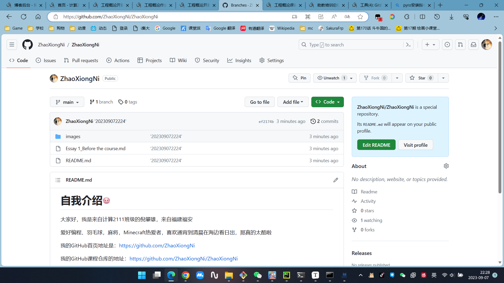
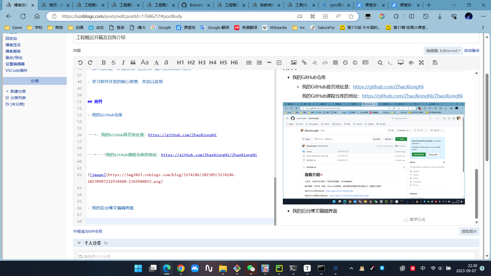

- # Before the course 工程概论开篇

  ## 基本信息

  | 这个作业属于哪个课程 | [计算21级 - 集美大学](https://edu.cnblogs.com/campus/jmu/ComputerScience21) |
  | :------------------- | :----------------------------------------------------------: |
  | 这个作业要求在哪里   | [工程概论开篇](https://edu.cnblogs.com/campus/jmu/ComputerScience21/homework/13033) |
  | 这个作业的目标       | 熟悉Git与GitHub的使用，学会使用MarkDown编辑器，介绍自己，理清学习目标、方向 |

  ## 自我介绍

  大家好，我是来自计算2111班级的倪肇雄，来自福建福安

  爱好编程、羽毛球，麻将，Minecraft热爱者，喜欢通宵到清晨在海边看日出，那真的太酷啦

  我的GitHub首页地址是：https://github.com/ZhaoXiongNi

  我的GitHub课程仓库的地址：https://github.com/ZhaoXiongNi/ZhaoXiongNi

  我的个人网站地址（维护中）：https://www.codenzx.cn

  

  ### 学习经历

  目前集美大学大三在读 (2021-2025)

  

  ## 我遇到的问题

  1. 什么是结构化开发，需要怎么做

  2. 敏捷过程开发在实际开发中如何体现

  3. 设计模式怎么应用到实际构件中

  4. 面向对象分析的如何规划

  5. 我可以在这门课的学习后到达什么样的能力水准，亦或是感受到什么

  

  ## 想要收获的东西

  - 技术上的进一步规范化、过程化，提升自身的技术素养

  - 学习软件开发的核心思想，并加以应用

  ## 附件

  - 我的GitHub仓库

  	- 我的GitHub首页地址是：https://github.com/ZhaoXiongNi

  		我的GitHub课程仓库的地址：https://github.com/ZhaoXiongNi/ZhaoXiongNi

  

  

  - 我的后台博文编辑界面

  
